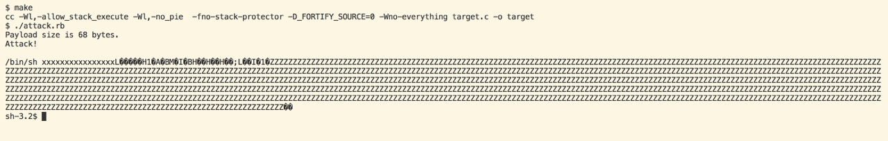

# x86-64 Buffer Overflow for macOS
This is a buffer overflow for a x86-64 Mach-O binary with PIE, stack protection, stack NX and source fortification disabled.

It's mostly stable but the location of the array varies considerably depending on factors such as changing terminal emulators or the terminal prompt. It is advised to try to compile a version of target with printf or use lldb to find out the array address first, but it isn't purely random. Otherwise this would have been an exercise in futility.

# How it works
At the beginning of the array, there are eight bytes dedicated to the string `"/bin/sh"`, eight bytes are the pointer to that string, eight bytes are null and the rest is assembly code for the attack.

A Ruby script is used to construct the attack, which is written in Apple assembler with Intel syntax.

The attack works as follows:
* strcpy puts `"/bin/sh XXXXXXXXXXXXXXXXX"` in the beginning of the array followed by `0x90` (NOP instructions) for the remainder of the array and 32 bytes of ABI artifacts, then replaces the return address with the pointer to the array.
    * The pointer to the array can be obtained by running the executable under lldb or a similar tool.
* The attack adds the null terminator to the string and constructs an array consisting of [0] the pointer to the string and [1] the null terminator.
* Uses the System V `execve` system call to execute /bin/sh.
* Provides a shell.

A screenshot of the attack in action:

# License
The Unlicense. Check 'UNLICENSE'.

# References
[0] XNU Kernel Syscall Listing https://github.com/opensource-apple/xnu/blob/master/bsd/kern/syscalls.master

[1] UNIX System V Application Binary Interface AMD64 Architecture Processor Supplement https://www.uclibc.org/docs/psABI-x86_64.pdf
